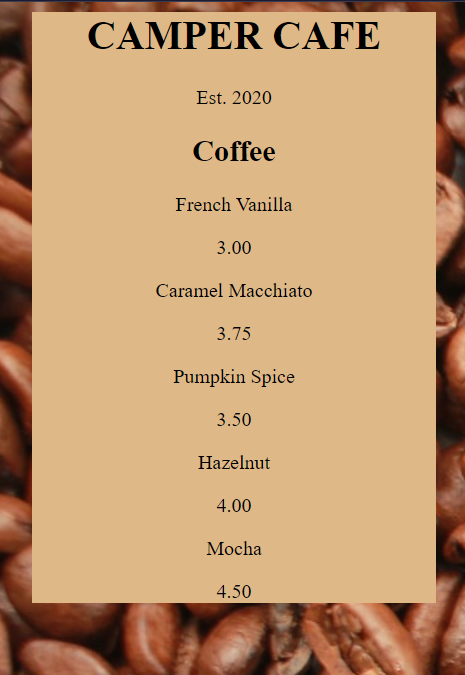

# Learn Basic CSS by Building a Cafe Menu

[Live Preview](https://rawcdn.githack.com/codem1ner/free-code-camp/4d1bd55d2ae6f39a7e19ee9e456f0e247aff34e6/responsive-web-design/css-cafe-menu/index.html)

## Part 1: Menu Section Creation


```html
<body>    
    <div id="menu">
        <main>
            <h1>CAMPER CAFE</h1>
            <p>Est. 2020</p>
            <section>
                <h2>Coffee</h2>
            </section>
        </main>
    </div>
</body>
```

```css
h1, h2, p {
  text-align: center;
}

.menu {
  width: 80%;
  background-color: burlywood;
  margin-left: auto;
  margin-right: auto;
}
```

Next, the menu section is created and items are added to it.

## Part 2: Menu Items



- Menu items are stacked vertically.
- 

### HTML
```html
<!DOCTYPE html>
<html lang="en">
  <head>
    <meta charset="utf-8" />
    <meta name="viewport" content="width=device-width, initial-scale=1.0" />
    <title>Cafe Menu</title>
    <link href="styles.css" rel="stylesheet"/>
  </head>
  <body>
    <div class="menu">
      <main>
        <h1>CAMPER CAFE</h1>
        <p>Est. 2020</p>

        <section>
          
          <h2>Coffee</h2>
          <article>
            <p>French Vanilla</p>
            <p>3.00</p>
          </article>

          <article>
            <p>Caramel Macchiato</p>
            <p>3.75</p>
          </article>

          <article>
            <p>Pumpkin Spice</p>
            <p>3.50</p>
          </article>

          <article>
            <p>Hazelnut</p>
            <p>4.00</p>
          </article>

          <article>
            <p>Mocha</p>
            <p>4.50</p>
          </article>

        </section>
      </main>
    </div>
  </body>
</html>
```
### CSS 
```css
body {
  background-image: url(https://cdn.freecodecamp.org/curriculum/css-cafe/beans.jpg);
}

h1, h2, p {
  text-align: center;
}

.menu {
  width: 80%;
  background-color: burlywood;
  margin-left: auto;
  margin-right: auto;
}
```